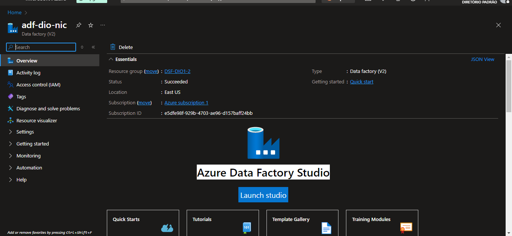
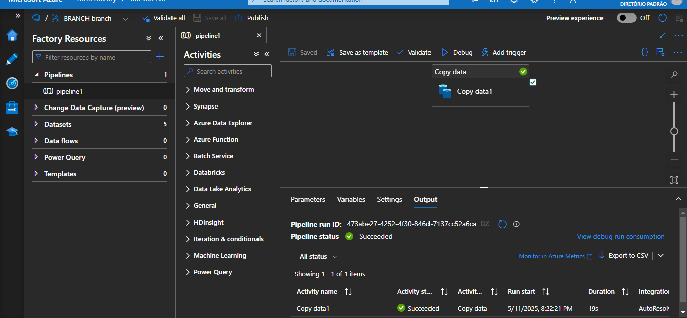
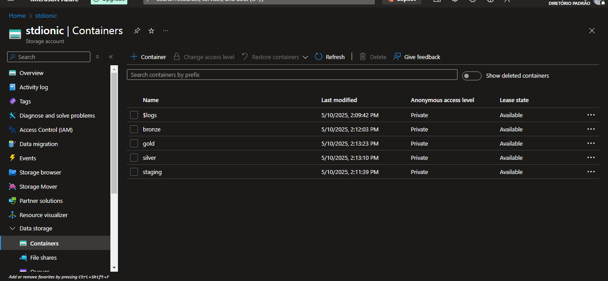

# Desafios do Bootcamp "Microsoft AI for Tech - Azure Databricks" - DIO

Este repositório reúne a entrega de **dois desafios distintos** propostos durante o Bootcamp da DIO ministrado pela professora **Carol**. Ambos foram organizados em um único repositório devido à continuidade lógica entre eles e à reutilização de recursos, como o mesmo Data Factory.

---

## Desafio 01 - Criando um Monitoramento de Custos no Data Factory

### Contexto do Desafio

O primeiro desafio do Bootcamp consistiu em **criar um Azure Data Factory** e, em seguida, gerar um **dashboard** com os dados manipulados. Esse foi um desafio introdutório, cujo principal objetivo era se familiarizar com a plataforma Azure e entender o papel do Data Factory na arquitetura de dados.

### O Que a Professora Carol Fez

- Criou uma **conta no Azure**.
- Criou um **Azure Data Factory**.
- Montou um **dashboard básico**.

### O Que Eu Fiz

Segui exatamente os mesmos passos apresentados pela professora Carol, visto que, neste estágio do Bootcamp, o foco era entender e replicar a estrutura da solução apresentada. Não houve variações relevantes ou possibilidades de customização mais avançadas neste desafio.

### Ferramentas Utilizadas

- Azure Portal  
- Azure Data Factory

### Evidências

- **Imagem 1**: Criação do Azure Data Factory

 

- **Imagem 2**: Dashboard gerado

 

---

## Desafio 02 - Criando Processos de Redundância de Arquivos na Azure

### Contexto do Desafio

Neste segundo desafio, a proposta foi criar uma integração entre uma **tabela de um banco de dados local** e o Azure, utilizando o **Integration Runtime** do Data Factory para importar os dados e armazená-los em um **Azure Storage**, preferencialmente em formato **CSV**.

### O Que a Professora Carol Fez

- Usou o **Integration Runtime** para conectar ao banco de dados local presente em sua máquina.
- Copiou uma tabela específica e a **armazenou em um Azure Storage** no formato **CSV**.
- Todo o processo foi realizado dentro de um **pipeline no Azure Data Factory**.

### O Que Eu Fiz

Como encontrei **problemas técnicos ao configurar o Integration Runtime** na minha máquina, segui uma abordagem alternativa:

1. **Criação de Banco de Dados na Nuvem**:
   - Criei um banco de dados no **Azure SQL Server**.
   - Utilizei scripts de **criação de tabelas e inserção de dados** que desenvolvi em um desafio anterior da própria DIO.

2. **Processo de Ingestão e Armazenamento**:
   - Configurei um pipeline no **Azure Data Factory** para importar as tabelas criadas.
   - Armazenei os dados no **Azure Storage**, mas optei por usar o formato **Parquet**, em vez do CSV utilizado pela professora.

3. **Motivação para a Escolha do Formato Parquet**:
   - Após assistir a todas as aulas do módulo, compreendi que o **formato Parquet possui vantagens importantes** em comparação ao CSV, como:
     - Melhor compressão e desempenho;
     - Otimização para leitura de colunas específicas;
     - Ideal para grandes volumes de dados analíticos.

### Ferramentas Utilizadas

- Azure SQL Database  
- Azure Data Factory  
- Azure Storage 

### Evidências

- **Imagem 3**: Script SQL usado para recriar as tabelas  

 

- **Imagem 4**: Pipeline do Azure Data Factory configurado  

 

- **Imagem 5**: containers criados no Azure Storage

 

- **Imagem 6**: Arquivos armazenados em formato Parquet no Azure Storage

 

---

## Considerações Finais

- Os dois desafios foram desenvolvidos com base nas instruções da professora Carol, mas **o segundo desafio exigiu adaptação** e uso de alternativas devido a limitações técnicas com o Integration Runtime.
- As escolhas tomadas, como **usar um banco em nuvem e o formato Parquet**, foram feitas com base no conhecimento adquirido ao longo das aulas e nas melhores práticas sugeridas pela própria plataforma.
- A unificação dos dois desafios neste repositório visa **evitar duplicidade de recursos**, já que o mesmo Data Factory foi utilizado em ambos.

---
